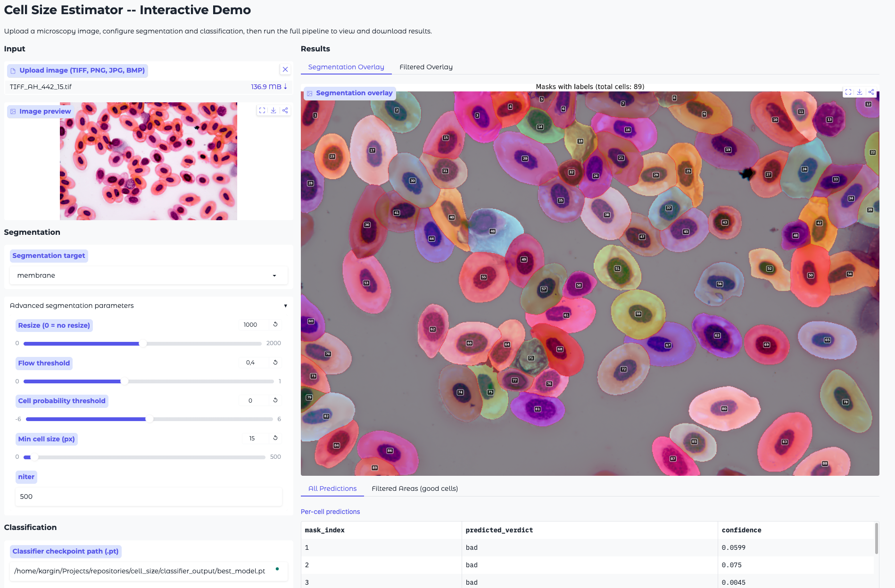

# Cell Size Estimator

Batch cell segmentation and size estimation for microscopy images using
[Cellpose-SAM](https://github.com/MouseLand/cellpose), driven by
[Hydra](https://hydra.cc/) configuration.

## Features

- **Batch processing** -- point at a directory and segment every image in one
  command.
- **Membrane or nucleus** segmentation via preset configs.
- **Hydra configuration** -- override any parameter from the CLI; supports
  multirun for parameter sweeps.
- **Resume support** -- re-run safely; already-processed images are skipped.
- **Auto pixel-scale detection** from OME-TIFF metadata, with manual fallback.
- **Multiple output formats** -- masks as 16-bit TIFF or NumPy `.npy`.
- **Optional overlays and histograms** for quality checking.
- **Catalog CSV** recording every processed image with metadata.
- **Cell quality classifier** -- train a binary good/bad classifier from human
  feedback and automatically filter cells during size estimation.
- **Nucleus measurements** -- run segmentation twice (membrane + nucleus) and
  the inference pipeline automatically matches nuclei to cells, reporting
  nucleus area, diameters, and nucleus-to-cytoplasm (N/C) ratio.

## Installation

### Option 1: conda (recommended)

```bash
# Clone with submodules
git clone --recurse-submodules <repo-url>
cd cell_size

# Create and activate a new conda environment
conda create -n cell-size python=3.10 -y
conda activate cell-size

# Install PyTorch with CUDA (adjust cuda version to match your driver)
conda install pytorch torchvision pytorch-cuda=12.4 -c pytorch -c nvidia -y

# Install the package in editable mode
pip install -e .

# Install the cellpose submodule
pip install -e cellpose/
```

### Option 2: pip + venv

```bash
# Clone with submodules
git clone --recurse-submodules <repo-url>
cd cell_size

# Create and activate a virtual environment
python -m venv .venv && source .venv/bin/activate

# Install in editable mode
pip install -e .

# The cellpose submodule is imported at runtime via sys.path.
# If you prefer, you can also install it:
pip install -e cellpose/
```

> **GPU**: Make sure PyTorch with CUDA is installed for GPU acceleration.
> See <https://pytorch.org/get-started/locally/>.

## Quick Start

Segment all `.tif` images in a directory (membrane mode, default):

```bash
cell-size data.data_dir=/path/to/images
```

Segment nuclei instead:

```bash
cell-size data.data_dir=/path/to/images segmentation=nucleus
```

Use multiple file types with resize and overlays:

```bash
cell-size \
  data.data_dir=/path/to/images \
  data.file_types='[".tif",".jpg",".png"]' \
  segmentation.resize=1000 \
  output.generate_overlays=true \
  output.compute_cell_areas=true \
  cell_type=FrogBlood
```

Force reprocessing of all images:

```bash
cell-size data.data_dir=/path/to/images force=true
```

Hydra multirun (parameter sweep):

```bash
cell-size -m \
  data.data_dir=/path/to/images \
  segmentation.flow_threshold=0.3,0.4,0.5
```

## Configuration

All configuration lives in `src/cell_size/configs/` and follows Hydra conventions.

### Main config (`src/cell_size/configs/config.yaml`)

| Key         | Default     | Description                        |
|-------------|-------------|------------------------------------|
| `cell_type` | `"Unknown"` | Label for the Cell_Type CSV column |
| `force`     | `false`     | Reprocess already-segmented images |

### Data (`src/cell_size/configs/data/default.yaml`)

| Key            | Default    | Description                                            |
|----------------|------------|--------------------------------------------------------|
| `data_dir`     | (required) | Path to the image dataset                              |
| `file_types`   | `[".tif"]` | Image extensions to look for                           |
| `recursive`    | `true`     | Scan subdirectories                                    |
| `channels`     | `null`     | Channel indices to select (null = use all)             |
| `pixel_to_um`  | `null`     | Manual µm/pixel value (null = auto-detect from metadata) |

### Segmentation (`src/cell_size/configs/segmentation/`)

Two presets: `membrane` (default) and `nucleus`.

| Key                   | membrane | nucleus | Description                           |
|-----------------------|----------|---------|---------------------------------------|
| `target`              | membrane | nucleus | Descriptive label                     |
| `chan`                 | 0        | 1       | Primary channel for cellpose          |
| `chan2`                | 0        | 0       | Secondary channel                     |
| `flow_threshold`      | 0.4      | 0.4     | Flow error threshold                  |
| `cellprob_threshold`  | 0.0      | 0.0     | Cell probability threshold            |
| `tile_norm_blocksize` | 0        | 0       | Block size for tile normalisation (0 = global) |
| `resize`              | 0        | 0       | Resize longest side before segmentation (0 = no resize) |
| `min_cell_size`       | 15       | 15      | Minimum cell size in pixels           |

### Model (`src/cell_size/configs/model/cpsam.yaml`)

| Key                 | Default  | Description                              |
|---------------------|----------|------------------------------------------|
| `model_type`        | `"cpsam"` | Cellpose model name                     |
| `custom_model_path` | `null`   | Path to a custom fine-tuned model        |
| `gpu`               | `true`   | Use GPU (falls back to CPU if unavailable) |
| `batch_size`        | `32`     | Batch size for model evaluation          |

### Output (`src/cell_size/configs/output/default.yaml`)

| Key                  | Default        | Description                                  |
|----------------------|----------------|----------------------------------------------|
| `mask_format`        | `"tif"`        | `"tif"` or `"npy"`                           |
| `csv_path`           | `"results.csv"` | Catalog CSV file path (relative to data_dir) |
| `generate_overlays`  | `false`        | Save outline overlay PNGs                    |
| `generate_plots`     | `false`        | Save cell-area histogram PNGs                |
| `compute_cell_areas` | `false`        | Write per-image cell area CSVs               |

## Dual-Run Workflow (Membrane + Nucleus)

To measure both cell and nucleus sizes, run the batch segmentation twice on the
same dataset -- once for membrane and once for nucleus. The outputs are saved
with distinct names so they coexist in the same per-image folders:

```bash
# 1. Segment membranes (default naming: _mask.tif, _overlay.png, ...)
cell-size data.data_dir=/path/to/images output.generate_overlays=true

# 2. Segment nuclei (nucleus naming: _nucleus_mask.tif, _nucleus_overlay.png, ...)
cell-size data.data_dir=/path/to/images segmentation=nucleus output.generate_overlays=true
```

Membrane outputs keep their original names (backward-compatible). Nucleus
outputs use a `_nucleus_` infix. Each run also writes its own catalog CSV
(`results.csv` for membrane, `results_nucleus.csv` for nucleus).

During `cell-size-classify` inference, the pipeline automatically detects
nucleus masks (`_nucleus_mask.tif`) alongside membrane masks and adds
nucleus measurements to `filtered_areas.csv`:

| Column                  | Description                              |
|-------------------------|------------------------------------------|
| `nucleus_area_px`       | Nucleus area in pixels                   |
| `nucleus_major_axis_px` | Nucleus long diameter (px)               |
| `nucleus_minor_axis_px` | Nucleus short diameter (px)              |
| `nc_ratio`              | Nucleus-to-cell area ratio               |
| `nucleus_area_um2`      | Nucleus area in µm² (if scale known)     |
| `nucleus_major_axis_um` | Nucleus long diameter in µm              |
| `nucleus_minor_axis_um` | Nucleus short diameter in µm             |

Cells with no matching nucleus get `NaN` for all nucleus columns. When
multiple nuclei overlap a cell, only the largest (by pixel overlap) is used.

## Output Structure

After processing both membrane and nucleus, each image folder contains:

```
data_dir/
  projectA/
    image000/
      image000.jpg                    # original image (moved here)
      image000_mask.tif               # membrane segmentation mask
      image000_overlay.png            # (optional) membrane overlay
      image000_areas.csv              # (optional) membrane cell areas
      image000_histogram.png          # (optional) membrane area histogram
      image000_nucleus_mask.tif       # nucleus segmentation mask
      image000_nucleus_overlay.png    # (optional) nucleus overlay
      image000_nucleus_areas.csv      # (optional) nucleus areas
      image000_nucleus_histogram.png  # (optional) nucleus area histogram
    image001/
      image001.tif
      image001_mask.tif
      image001_nucleus_mask.tif
  results.csv                         # membrane catalog CSV
  results_nucleus.csv                 # nucleus catalog CSV
```

### Catalog CSV format

```csv
Relative_Path,Image_Name,File_Type,Mask_Name,Resize,Cell_Type,Timestamp
projectA/image000,image000,jpg,image000_mask,1000,FrogBlood,2026-03-10T17:30:00
```

## Cell Quality Classifier

The classifier module automates the human-in-the-loop cell validation
workflow. Biologists review segmented cells in a web UI and label them as
"good" (include in size estimation) or "bad" (exclude). The classifier learns
from these labels and applies the same filtering automatically to new datasets.

### Training

```bash
cell-size-train \
    feedback_csvs='["/path/to/feedback1.csv", "/path/to/feedback2.csv"]' \
    data_dir=/path/to/segmented/data \
    output_dir=./classifier_output \
    classifier.encoder='timm/vit_small_patch16_dinov3.lvd1689m' \
    classifier.use_efficient_probing=true \
    classifier.efficient_probing.num_queries=32 \
    classifier.freeze_encoder=true \
    classifier.epochs=30
```

Pipeline: merge feedback CSVs -> majority-vote consensus -> extract cell
crops -> train/val/test split -> train -> evaluate -> save checkpoint +
confusion matrix.

### SLURM launcher (training only)

For running many training experiments on a SLURM cluster, use
`scripts/launch_classifier_train_parallel.sh`. It submits one job per run,
supports `--dry-run`, and throttles submissions with `--max-concurrent` using
`squeue`.

Minimal example:

```bash
DATA_DIR=/path/to/segmented/data \
FEEDBACK_CSVS='["/path/to/feedback.csv"]' \
OUTPUT_DIR=/path/to/output_dir \
bash scripts/launch_classifier_train_parallel.sh --dry-run --max-concurrent 20 \
  --encoders resnet18,'timm/vit_small_patch16_dinov3.lvd1689m' --freeze both --train-with-val false --lrs 0.001,0.0005 --thresholds 0.7 --cv both \
  classifier.epochs=30 classifier.batch_size=64
```

Each run writes into `OUTPUT_DIR/<run_name>/`:

- `best_model.pt`
- `confusion_matrix.png` (when test split exists)
- `results.csv` (one-row summary)

Additionally, a central `OUTPUT_DIR/experiments.csv` is appended (one row per
run, safe under concurrent SLURM jobs).

#### `experiments.csv` schema

Fixed columns (one row per run):

```text
run_name,encoder,freeze_encoder,learning_rate,confidence_threshold,seed,cross_validation,k_folds,best_val_f1,test_accuracy,test_precision,test_recall,test_f1,best_checkpoint_path,confusion_matrix_path,slurm_job_id,status,started_at,finished_at,hostname,pid
```

### Inference

```bash
cell-size-classify \
    checkpoint=./classifier_output/best_model.pt \
    data_dir=/path/to/new/segmented/data \
    output_dir=./classify_output \
    classifier.confidence_threshold=0.7
```

Pipeline: load model -> classify every cell in the dataset -> write
predictions CSV -> compute filtered areas (good cells only) -> generate
filtered overlay images.

### Classifier Configuration (`src/cell_size/configs/classifier/default.yaml`)

| Key                          | Default      | Description                                             |
|------------------------------|--------------|---------------------------------------------------------|
| `crop_size`                  | `224`        | Cell crop resize resolution                             |
| `crop_padding_pct`           | `0.2`        | Padding around bounding box (fraction)                  |
| `crop_format`                | `"png"`      | Saved crop format (`png` or `jpg`)                      |
| `mask_background`            | `false`      | Zero out pixels outside cell mask                       |
| `crops_dir`                  | `"crops"`    | Output directory for extracted crops                    |
| `split_ratio`                | `[0.7, 0.15, 0.15]` | Train / val / test split ratio                 |
| `seed`                       | `42`         | Random seed for splitting and reproducibility           |
| `encoder`                    | `"resnet18"` | Backbone: `resnet18`, `resnet50`, `vit_b_16`, `efficientnet_b0`, `squeezenet1_1`, or `timm/<model_name>` (e.g. `timm/vit_small_patch16_dinov3.lvd1689m`) |
| `freeze_encoder`             | `false`      | Freeze backbone, train only classification head         |
| `pretrained`                 | `true`       | Use ImageNet-pretrained weights                         |
| `train_with_val`             | `false`      | Final-fit mode: train on `train+val`, and monitor/select checkpoint on `test` (incompatible with cross-validation) |
| `use_mlp_head`               | `false`      | Use MLP head: `Linear(in,128)->ReLU->Linear(128,32)->ReLU->Linear(32,8)->ReLU->Linear(8,1)` |
| `use_efficient_probing`      | `false`      | Use efficient probing head on patch tokens (timm ViT encoders only; mutually exclusive with `use_mlp_head`) |
| `efficient_probing.num_queries` | `32`      | Number of learnable query tokens for efficient probing  |
| `efficient_probing.num_heads`   | `1`       | Number of attention heads in efficient probing          |
| `efficient_probing.d_out`       | `1`       | Channel reduction factor (`C' = C / d_out`)            |
| `efficient_probing.qkv_bias`    | `false`   | Enable bias in efficient probing value projection       |
| `efficient_probing.qk_scale`    | `null`    | Optional custom QK scale (default uses head dim scaling) |
| `epochs`                     | `50`         | Maximum training epochs                                 |
| `batch_size`                 | `32`         | Training batch size                                     |
| `learning_rate`              | `0.001`      | Adam learning rate                                      |
| `weight_decay`               | `0.0001`     | Adam weight decay                                       |
| `early_stopping_patience`    | `7`          | Epochs without improvement before stopping              |
| `confidence_threshold`       | `0.7`        | Minimum confidence to label a cell as "good"            |
| `gpu`                        | `true`       | Use GPU if available                                    |
| `wandb.enabled`              | `false`      | Enable Weights & Biases logging                         |
| `wandb.project`              | `"cell-quality"` | WandB project name                                  |
| `cross_validation.enabled`   | `false`      | Use k-fold cross-validation instead of single split     |
| `cross_validation.k_folds`   | `5`          | Number of folds                                         |

### Training Config (`src/cell_size/configs/train.yaml`)

| Key              | Default                  | Description                              |
|------------------|--------------------------|------------------------------------------|
| `feedback_csvs`  | `[]`                     | List of feedback CSV file paths          |
| `data_dir`       | `null`                   | Root of segmented dataset                |
| `output_dir`     | `"./classifier_output"`  | Where to save crops, checkpoints, plots  |

### Inference Config (`src/cell_size/configs/classify.yaml`)

| Key                          | Default                | Description                               |
|------------------------------|------------------------|-------------------------------------------|
| `checkpoint`                 | `null`                 | Path to trained model checkpoint           |
| `data_dir`                   | `null`                 | Root of segmented dataset to classify      |
| `output_dir`                 | `"./classify_output"`  | Output directory for predictions           |
| `compute_filtered_areas`     | `true`                 | Compute areas for good cells only          |
| `generate_filtered_overlays` | `true`                 | Generate overlay images with filtering     |
| `pixel_to_um`                | `null`                 | Manual pixel-to-um scale for area calc     |

### Feedback CSV Format

The feedback CSV (from the review web UI) must have these columns:

```csv
dataset,image_path,mask_index,verdict,reviewer_email,comment,reviewed_at
datasetA,img001,25,good,reviewer@example.com,"Cell is circular",2026-03-16T14:00:00
```

### Classifier Output

```
classifier_output/
  crops/
    train/good/*.png
    train/bad/*.png
    val/good/*.png
    val/bad/*.png
    test/good/*.png
    test/bad/*.png
  best_model.pt           # best checkpoint (by val F1)
  confusion_matrix.png    # test set confusion matrix

classify_output/
  predictions.csv         # per-cell predictions with confidence
  filtered_areas.csv      # areas + diameters + nucleus measurements for good cells
  overlays/
    img001_filtered_overlay.png   # cell outlines + nucleus boundaries (cyan)
    img002_filtered_overlay.png
```

## Interactive Demo (Gradio)

A browser-based demo that runs the full pipeline end-to-end: upload an image,
segment cells, classify them as good/bad, and view filtered results.



### Install

```bash
pip install -e ".[demo]"
```

### Launch

```bash
# Via CLI entry point
cell-size-demo

# Or directly
python demo/app.py

# With a public share link
cell-size-demo --share

# Custom host/port
cell-size-demo --server-name 0.0.0.0 --server-port 8080
```

Then open `http://localhost:7860` in your browser.

### What it does

1. Upload a single microscopy image.
2. Choose membrane or nucleus segmentation, adjust parameters via sliders.
3. Check "Also segment nuclei" (enabled by default when using membrane mode)
   to get nucleus measurements alongside cell measurements.
4. Optionally provide a trained classifier checkpoint (`.pt` file).
5. Click **Run Pipeline** to:
   - Segment all cells (and nuclei if enabled) and show a numbered overlay.
   - Classify each cell as good/bad (if checkpoint is provided).
   - Show the filtered overlay (good cells in colour, bad cells greyed out,
     nucleus boundaries in cyan).
   - Display per-cell predictions table and filtered areas with diameters
     and nucleus measurements (area, diameters, N/C ratio).
   - Provide downloadable CSV files for both tables.

## Interactive Embedding Explorer (Streamlit)

An interactive Streamlit app for visualizing classifier crop embeddings in 2D
or 3D and inspecting individual crop images directly from the scatter plot.

### Install

```bash
pip install -e ".[streamlit]"
```

### Launch

```bash
# Via CLI entry point
cell-size-streamlit

# Custom host/port
cell-size-streamlit --server-name 0.0.0.0 --server-port 8501

# Or directly with streamlit
streamlit run demo/streamlit_embedding_app.py
```

Then open `http://localhost:8501` in your browser.

### Data requirements

The app expects crop data generated by classifier training in this layout:

```text
classifier_output/
  crops/
    mask_bg_false/
      train/{good,bad}/*.jpg
      val/{good,bad}/*.jpg
      test/{good,bad}/*.jpg
    mask_bg_true/
      train/{good,bad}/*.jpg
      val/{good,bad}/*.jpg
      test/{good,bad}/*.jpg
```

Model selection is checkpoint-based (`best_model.pt`) and discovered from a
search root you can set in the UI.

### What it does

1. Select crop root, mask mode, split, and checkpoint.
2. Choose embedding method: `PCA`, `t-SNE`, or `UMAP`.
3. Switch between 2D and 3D interactive Plotly scatter views.
4. Apply uncertainty reject band thresholds (`t_bad`, `t_good`) to label each
   sample as accepted-good, accepted-bad, or rejected.
5. Color points by true label, predicted label, accepted/rejected status, or
   confusion class (`TP`, `TN`, `FP`, `FN`, `REJECT`).
6. Click points (or select top uncertain points) to preview exact crop images
   and metadata in the side panel.
7. Export selected points as CSV.

### Notes

- Features and embeddings are computed on the fly from the currently selected
  model/split/settings.
- For efficient-probing checkpoints (`use_efficient_probing=true`), embeddings
  are built from probe output features (`x_cls`) before the final binary layer.
- By default, recomputation is manual (`Run / Refresh`) to avoid repeated heavy
  reruns while changing controls; you can enable auto-recompute in the sidebar.
- If `umap-learn` is unavailable, the UI disables UMAP and keeps PCA/t-SNE
  available.

## License

MIT
